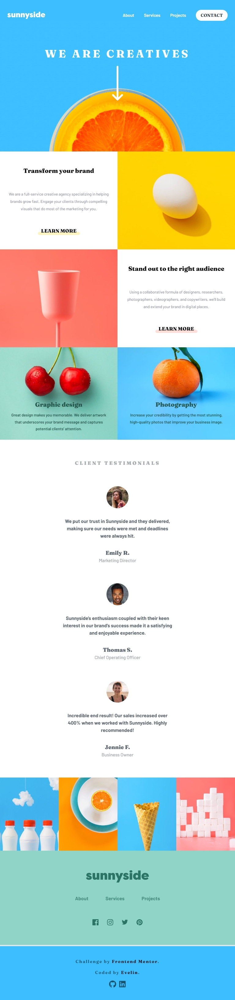

 
  <h1>Sunnyside Agency Landing Page</h1>

 
  
   
  
  
  
  
  

## Description

This project is a responsive landing page for the Sunnyside Agency, built with React and Tailwind CSS. It features a header with navigation, a cover page, service descriptions, testimonials, a gallery, and a footer. The landing page is designed to provide a visually appealing and informative experience across a wide range of devices.

## Key Features

- **Header with Navigation:** Includes a responsive navigation menu.
- **Cover Page:** A visually appealing introduction to the agency.
- **Services Section:** Highlights the key services offered by the agency.
- **Testimonials:** Showcases customer feedback and testimonials.
- **Gallery:** Displays a collection of images related to the agency's work.
- **Footer:** Contains additional links and social media icons.
- **Responsive Design:** Ensures the website looks great on all devices.

## Screenshots

  
    
   
     
   

## Additional Information

- Icons used in the project are sourced from [svgrepo.com](https://www.svgrepo.com/) and [react icons](https://react-icons.github.io/react-icons/).
- Challenge by [Frontend Mentor](https://www.frontendmentor.io).
- This project uses [React Icons](https://react-icons.github.io/react-icons/) for various UI elements.

Check out the live project: [Sunnyside Agency Landing Page](https://sunnyside-agency-landing-page-gamma-eight.vercel.app/)
